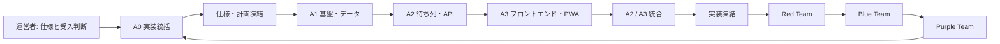

# 実装エージェント構成・分担計画

## 1. 目的

本書は、スパQを実装する際に、複数のコーディングエージェントが重複作業や仕様の解釈違いを起こさずに進めるための担当構成を定義する。

エージェント構成はアプリの機能ではない。実装作業を安全に分けるための体制である。利用者アカウント、SMS、専用バックエンド、別途の管理画面を追加するものではない。

## 2. 結論

MVPは、**実装フェーズを順番に完了・凍結し、全実装後に独立したRed / Blue / Purple Teamが総合レビューするウォーターフォール型**で進める。

通常の実装担当は4役割、最終レビューは3役割とする。

| 区分 | ID | 役割 | 必要性 | 主な責務 |
|---|---|---|---|---|
| 実装 | A0 | 実装統括・統合 | 必須 | 仕様の正本管理、工程の凍結、PR統合、受入判断 |
| 実装 | A1 | 基盤・データ担当 | 必須 | Next.js基盤、Supabase migration / seed、環境変数・デプロイの引き継ぎ資料 |
| 実装 | A2 | 待ち列ドメイン・API担当 | 必須 | TypeScript待ち時間計算、状態遷移、Route Handler、Cron、Realtime送信 |
| 実装 | A3 | フロントエンド・PWA担当 | 必須 | Mock準拠の画面、検索、状態表示、カウントダウン、通知許可UI |
| 最終レビュー | R1 | Red Team | 必須 | 攻撃者・不正利用者・障害発生者の視点で弱点を発見する |
| 最終レビュー | R2 | Blue Team | 必須 | 守り・復旧・運用・品質の観点で対策と証跡を確認する |
| 最終レビュー | R3 | Purple Team | 必須 | Redの指摘とBlueの対策を突合し、修正の有効性を最終判定する |

実装人数が少ない場合でも、R1・R2・R3は担当実装者本人が自分の成果物を承認してはならない。少なくとも別のレビュー担当が、固定されたテスト手順と証跡により確認する。

## 3. 推奨する実行構成

実装タスクごとに作って確認して戻る反復型ではなく、工程の成果物を凍結してから次工程へ渡す。最後に実装全体を固定し、Red / Blue / Purple Teamが順にレビューする。

### フェーズ別の稼働人数

| フェーズ | 主担当 | 工程の出口条件 |
|---|---|---|
| 0. 仕様・計画凍結 | A0 | 本書と[実装計画書](/Users/haruki.shimo/Documents/tesla_supercharger/docs/implementation-plan.md)を承認し、実装範囲・DB・API・画面を固定 |
| 1. 基盤・初期データ | A1 | Next.js、Supabase migration、152施設seed、ローカルproduction buildが動く。接続方式を凍結 |
| 2. 待ち列・API | A2 | 計算、状態遷移、Route Handler、Cronの単体・統合試験が通る。API契約を凍結 |
| 3. 画面・PWA | A3 | S-01〜S-18、検索、画面内カウントダウン、エラー表示を実装。画面遷移を凍結 |
| 4. 統合 | A2 + A3 | Realtime、通知、Cron、E2Eを接続。実装を凍結 |
| 5. Red Team | R1 | 攻撃・不正操作・競合・情報漏えいの観点で指摘を完了 |
| 6. Blue Team | R2 | 防御、復旧、監視可能性、受入条件、設定値を確認 |
| 7. Purple Team | R3 | Red指摘とBlue対策の突合・再試験を完了し、リリース可否を勧告 |
| 8. 運営者による反映 | 運営者 | R3のデプロイ引き継ぎ可判定後に、migration、seed、環境変数、Cron、Vercelデプロイを実施 |

フェーズ1が完了するまでは、A2とA3を本格稼働させない。特にDBの列名、APIのレスポンス形式、環境変数名が途中で変わると、後続の作業が大きくやり直しになるためである。フェーズ5以降は、レビュー指摘への修正だけを許可する。修正した範囲は、Red / Blue / Purple Teamが必要な試験をやり直す。

## 4. 各エージェントの担当範囲

### A0: 実装統括・統合

**担当すること**

- 本書と既存仕様書の矛盾を解消し、実装上の正本を明示する。
- 作業を小さなPR単位へ分割し、依存関係に沿って着手順を決める。
- API契約、DBスキーマ、画面遷移を変更する場合に、影響する担当へ通知する。
- ローカル検証の受入条件を確認し、運営者へのデプロイ引き継ぎ可否を判断する。

**担当しないこと**

- 個別の待ち時間計算、migration、画面を横断して直接編集しない。緊急修正を除き、担当者へ戻す。

**主な成果物**

- `README.md` または実装開始用のチェックリスト
- タスク一覧、PRの受入基準、変更履歴
- 実装順と各フェーズの完了確認

### A1: 基盤・データ担当

**担当すること**

- Next.js App Router + TypeScriptの初期化、Lint、テスト実行基盤、Vercel設定テンプレート。
- ローカル検証DBへのmigration適用方法、RLSの確認、運営者が行うSupabase反映手順。
- `charging_sites`、`site_slots`、`queue_entries`のmigrationと初期seedの管理。
- 152施設・752ストールのCSV / seedをレビューし、DB投入前後の件数を検証。
- `.env.example`、Vercel、Supabase、OneSignal、Turnstileの環境変数名と、運営者向け設定手順を整備。

**所有ファイルの目安**

- `supabase/migrations/`
- `supabase/seed/`
- `data/`
- `package.json`、設定ファイル、`.env.example`、`vercel.json`
- DB接続・設定だけを扱う `lib/server/` 配下

**完了条件**

- migrationとseedを空の検証DBへ適用でき、152施設・752ストール・752仮想スロットになる。
- ブラウザからDB基礎テーブルへ直接アクセスできない。
- 秘密情報がリポジトリ、ブラウザ向け環境変数、ログへ出ない。

### A2: 待ち列ドメイン・API担当

**担当すること**

- `lib/queue/`に、待ち時間計算・状態遷移・期限判定を純粋なTypeScriptとして実装する。
- 施設単位のトランザクションとロック、管理トークン照合、入力検証を実装する。
- 待ち列参加、本人状態取得、退出、開始、初回時間確定、延長、完了、Push Subscription登録のRoute Handlerを実装する。
- 外部スケジューラーからCron Routeを毎分呼び、5分前通知、呼出失効、終了3分前確認、終了予定5分後の自動完了を実装する。
- 施設単位の`queue_changed` Broadcastを送信し、各操作の冪等性を担保する。

**所有ファイルの目安**

- `lib/queue/`
- `app/api/queue/`
- `app/api/cron/`
- サーバー専用の認可、トークン、OneSignal送信、Realtime送信モジュール
- API・待ち時間計算・Cronのテスト

**実装上の不変条件**

- 待ち時間の計算ロジックはSQLではなくTypeScriptに置く。
- 初回の充電時間は5〜120分で一度だけ確定する。任意の途中変更は許可しない。
- 延長は終了予定3分前の確認からのみ行う。
- 終了、退出、呼出失効、自動完了では後続を再計算してから、有効エントリー行を削除する。
- Tesla連携は行わず、アプリ表示と現地が異なる場合は現地を優先する。

**完了条件**

- [api-contract.md](/Users/haruki.shimo/Documents/tesla_supercharger/docs/api-contract.md)の契約を満たす。
- 同一施設への同時参加・同時完了でFIFOとスロット割当が壊れない。
- 45分fallback、利用者が確定した時間、5分の呼出期限・自動完了期限が正しく反映される。

### A3: フロントエンド・PWA担当

**担当すること**

- [DESIGN.md](/Users/haruki.shimo/Documents/tesla_supercharger/DESIGN.md)と現在のMockを基準に、スマホ優先の画面を実装する。
- 施設自由検索、満車確認、待ち列参加、待機表示、充電開始、初回時間入力、終了・延長確認、結果画面を実装する。
- 待機人数、推定待ち時間、開始までのカウントダウンを画面内で更新する。
- Realtime受信後の再取得、切断時の10〜15秒polling、復帰時の再同期を実装する。
- OneSignalの通知許可UI、iPhone/iPadのホーム画面追加案内、PWA manifest / Service Workerを実装する。
- [error-catalog.md](/Users/haruki.shimo/Documents/tesla_supercharger/docs/error-catalog.md)の文言と再試行導線を画面へ反映する。

**所有ファイルの目安**

- `app/` のページ・レイアウト・スタイル
- `components/`
- `hooks/`、クライアント側状態・検索・カウントダウン
- `public/` のPWAアイコン・manifest・Service Worker関連
- UIテスト、アクセシビリティテスト

**完了条件**

- [screen-flow-spec.md](/Users/haruki.shimo/Documents/tesla_supercharger/docs/screen-flow-spec.md)のS-01〜S-18を状態に応じて表示できる。
- キー入力ごとにサーバー検索をせず、152施設の自由検索結果が100ms目標で更新される。
- レスポンシブ対応を必須とし、`320px`、`360px`、`390px`、`430px`幅で横スクロール、表示欠け、操作不能なCTAがない。
- Pushを拒否・未対応でも、待ち列の全操作を続けられる。
- 管理トークン、他人のニックネーム、DBの秘密情報を画面やURLへ出さない。

### R1: Red Team（攻撃・破綻の発見）

**役割**

Red Teamは、実装の正しさを前提にせず、悪意ある利用者、操作ミス、通信障害、同時操作、期限境界の観点から壊しにいく独立レビュアーである。原則として修正を実装せず、再現手順・影響・証跡・重大度を報告する。

**確認すること**

- 管理トークンを持たない者が他人の待ち列を操作できないか。
- ブラウザからDBの基礎テーブル、秘密情報、ニックネーム、Push Subscription IDへ直接到達できないか。
- 同時参加、同時完了、再送、順番到来直前の退出でFIFO・スロット数・待ち時間が壊れないか。
- 5分の呼出期限、終了3分前、終了予定5分後の境界で、二重呼出・二重完了・行の取り残しが起きないか。
- 値を改ざんしたリクエスト、5〜120分外の値、初回時間の再変更、期限外の延長、CAPTCHAの欠落を拒否できるか。
- Realtime payload、URL、画面、ログ、Push本文から個人情報・管理トークン・秘密情報が漏れないか。
- 通知拒否、切断、再接続、二重タブ、ブラウザデータ消去後に不正な操作や無限待機が起きないか。

**成果物と出口条件**

- 重大度をCritical / High / Medium / Lowで分類したRed Team報告書。
- 各指摘に再現手順、期待結果、実結果、証跡、影響範囲を記載する。
- CriticalまたはHighが1件でも未解決なら、Blue Teamへ進めずリリース不可とする。

### R2: Blue Team（防御・復旧・運用品質の確認）

**役割**

Blue Teamは、仕様どおりに防げること、失敗時に安全に復旧できること、本番で運用可能なことを確認する独立レビュアーである。Red Team報告を参照するが、Red Teamが試していない通常系・設定・運用も確認する。

**確認すること**

- RLS、Route Handler経由のDBアクセス、サーバー側環境変数の分離、トークンハッシュ、Rate Limit、CAPTCHA、CSPが設計どおりか。
- 失敗時に[error-catalog.md](/Users/haruki.shimo/Documents/tesla_supercharger/docs/error-catalog.md)の文言・再試行・現地優先案内が表示されるか。
- Cronが重複実行されてもPushの二重送信、二重削除、誤った繰上げを起こさないか。
- Realtime切断時にpollingへ切り替わり、再接続時に本人状態を再取得できるか。
- Pushを拒否・未対応でも、待ち列機能と終了処理を完了できるか。
- migration、seed、環境変数、外部スケジューラー、OneSignal、Turnstile、利用規約・プライバシーポリシーについて、運営者が設定・確認できる引き継ぎ手順が揃っているか。
- 152施設・752ストール、検索速度、必須のレスポンシブ表示、アクセシビリティ、E2Eが受入基準を満たすか。

**成果物と出口条件**

- Blue Team防御・運用チェックリストと、各項目の証跡。
- Red Teamの各指摘に対する修正内容、再発防止策、検証結果。
- Critical / Highが0件、Mediumは運営者がリリース前に受容したものだけ、Lowは既知課題一覧に記録済みであること。

### R3: Purple Team（突合・最終判定）

**役割**

Purple Teamは、Red Teamの攻撃シナリオとBlue Teamの防御・修正結果を独立して突合する最終レビュアーである。修正が「別の経路でも有効か」「新しい不具合を生んでいないか」を再試験し、A0へリリース可否を勧告する。

**確認すること**

- Red Teamの全指摘に、修正PR、テスト、再現不能の証跡が紐付くか。
- Blue Teamの防御確認が、実際にRed Teamの攻撃経路を遮断しているか。
- 修正後の待ち列ライフサイクル（参加→呼出→開始→時間確定→終了 / 延長→完了）に回帰がないか。
- 同時操作、期限到来、通知拒否、通信断、現地優先案内を含むE2Eを通せるか。
- リリース対象のcommit、migration、seed、環境変数一覧が固定され、レビュー後に未承認の変更が入っていないか。

**成果物と出口条件**

- Purple Team最終判定書。各Red指摘の状態、Blue証跡、Purple再試験結果、残存リスクを一覧化する。
- Critical / Highは0件、Mediumは運営者の明示承認済み、すべての必須受入条件がPASSであること。
- 条件を満たす場合だけ「デプロイ引き継ぎ可」とA0へ勧告する。A0単独では、この判定を省略できない。

## 5. 任意で追加するエージェント

次の役割は、現時点では専任にしない。必要になった時だけ、短期間のレビューまたは作業担当として追加する。

| 役割 | 追加する判断基準 | 主な確認内容 |
|---|---|---|
| PWA / Push専門レビュー | iPhone/iPadでPushを提供する時 | OneSignal、Service Worker、manifest、通知許可導線。R2を補助する |
| デザインレビュー | Mockとの差異が大きい時 | `DESIGN.md`準拠、モバイル可読性、アクセシビリティ |
| 施設データ更新担当 | 新施設追加・ストール数変更の時 | Tesla公式一覧との照合、CSV / seedレビュー、待ち列がない時間帯での適用 |

AI、地図、SMS、ログイン、専用インフラ、常時監視の担当は、現在のMVP要件では不要である。

## 6. 共有する正本資料

すべての実装エージェントは、着手前に次の資料を読む。仕様が衝突した場合は、A0が運営者へ確認し、資料を更新してから実装する。

| 資料 | 主な用途 |
|---|---|
| [requirements-definition.md](/Users/haruki.shimo/Documents/tesla_supercharger/docs/requirements-definition.md) | 機能要件、業務ルール、受入条件 |
| [technical-requirements.md](/Users/haruki.shimo/Documents/tesla_supercharger/docs/technical-requirements.md) | 技術方針、通知、検索、API・Cronの原則 |
| [screen-flow-spec.md](/Users/haruki.shimo/Documents/tesla_supercharger/docs/screen-flow-spec.md) | 画面一覧、状態ごとの遷移 |
| [database-schema.md](/Users/haruki.shimo/Documents/tesla_supercharger/docs/database-schema.md) | DBの一次定義、RLS、更新責務 |
| [queue-recalculation-spec.md](/Users/haruki.shimo/Documents/tesla_supercharger/docs/queue-recalculation-spec.md) | 再計算を発火する条件と処理順 |
| [api-contract.md](/Users/haruki.shimo/Documents/tesla_supercharger/docs/api-contract.md) | Route HandlerのJSON契約とエラー |
| [realtime-spec.md](/Users/haruki.shimo/Documents/tesla_supercharger/docs/realtime-spec.md) | Broadcastと画面再取得の仕様 |
| [error-catalog.md](/Users/haruki.shimo/Documents/tesla_supercharger/docs/error-catalog.md) | エラーコード、表示文言、復帰導線 |
| [deployment-configuration.md](/Users/haruki.shimo/Documents/tesla_supercharger/docs/deployment-configuration.md) | Vercel、Supabase、OneSignal、Turnstileの設定 |
| [DESIGN.md](/Users/haruki.shimo/Documents/tesla_supercharger/DESIGN.md) | Mock準拠のデザインルール |
| [tesla-japan-supercharger-research.md](/Users/haruki.shimo/Documents/tesla_supercharger/docs/tesla-japan-supercharger-research.md) | 152施設・752ストールの初期登録データ |

## 7. 実装開始前に運営者が用意する値

エージェントが推測で作成してはいけない値は、次のとおりである。値が未確定でも画面やコードの枠組みは作れるが、本番接続・公開はできない。

| 項目 | 用途 | 入力・決定者 |
|---|---|---|
| SupabaseプロジェクトURL・公開鍵・サーバー接続文字列 | DB接続、migration、サーバー処理 | 運営者 |
| Vercelプロジェクト・本番ドメイン | Preview / 本番配信、外部スケジューラー接続先 | 運営者 |
| OneSignal App ID・REST API Key | 任意のWeb Push | 運営者。REST API Keyはサーバー秘密情報 |
| Cloudflare Turnstile Site Key・Secret Key | 待ち列参加のBot対策 | 運営者。Secret Keyはサーバー秘密情報 |
| 利用規約の運営者名・連絡先・発効日 | 公開前の法的表示 | 運営者 |
| プライバシーポリシーの公開URL | 待ち列参加・通知案内 | 運営者。利用規約と同時に確定 |
| 本番seedの適用承認 | 施設マスタの作成 | 運営者 |

`SUPABASE_DATABASE_URL`、OneSignal REST API Key、Turnstile Secret Keyは、Vercelのサーバー側環境変数にだけ設定する。コミット、`NEXT_PUBLIC_*`、クライアントログ、画面表示に含めない。

## 8. 変更と引き継ぎのルール

- 1つのPRでは、原則として1担当の所有範囲だけを変更する。
- DBスキーマ変更はA1がmigrationとして作成し、A0が仕様との一致を確認する。既存migrationを書き換えず、新しい連番migrationを追加する。最終的な安全性レビューは実装凍結後にR1〜R3が行う。
- APIのJSON契約を変える時は、A2が`api-contract.md`を先に更新し、A3が追随する。
- 画面遷移・文言を変える時は、A3が該当仕様とエラーカタログを更新する。E2E試験の追加・確認は統合フェーズで行い、最終レビューでR2とR3が証跡を確認する。
- ストール数を変更するseedは、その施設に有効な待ち列がない時間にだけ適用する。
- 仕様にない挙動を実装で補わない。判断が必要な場合はA0を通じて運営者へ確認する。

## 9. 最初の実装バックログ

実装開始時は、次の順にタスクを渡す。

1. **A0**: 実装用リポジトリの構成、ブランチ・PR規約、受入チェックリストを作る。
2. **A1**: Next.js基盤、環境変数の雛形、Supabase migration / seed適用手順、DB接続のサーバー専用化を作る。
3. **A2**: 待ち時間計算の純粋関数とテストを先に作る。4ストール・同時空き・45分fallback・確定時間・延長を試験する。
4. **A2**: `join`、`me`、`cancel`、`start`、`duration`、`extend`、`complete`のRoute Handlerを状態遷移順に作る。
5. **A3**: 施設検索から待機中までの画面をMock準拠で作り、API契約に接続する。
6. **A3**: 充電開始、時間確定、終了3分前、延長、完了、復旧不可の画面を追加する。
7. **A2 / A3**: Realtime、OneSignal、Cronを接続する。Pushなしでも全動線が動くことを先に確認する。
8. **A0**: 全実装・テスト・設定値を凍結し、レビュー対象commitと証跡を固定する。
9. **R1**: Red Teamとして不正操作、競合、期限境界、情報漏えい、通知・通信障害を検証し、指摘報告を作る。
10. **R2**: Blue Teamとして防御・復旧・運用設定・受入条件を確認し、指摘への対策を検証する。
11. **R3**: Purple TeamとしてRed指摘とBlue証跡を突合し、回帰E2Eを実行して最終判定書を作る。
12. **運営者**: Purple Teamの「デプロイ引き継ぎ可」勧告後に、migration、seed、環境変数、Cron、Vercelデプロイを実施する。

## 10. 実装完了の判定

次のすべてを満たした時、MVP実装を完了とする。

- 施設を高速検索し、待ちなし・待ち列開始・待機・呼出・充電・延長・完了の一連を実行できる。
- 充電完了、退出、呼出失効、自動完了の後に有効エントリーが削除され、利用者情報を残さない。
- 施設ごとの同時操作でもFIFO、ストール数、待ち時間が矛盾しない。
- 画面内更新はRealtimeとfallback pollingで行い、通知許可の有無に依存しない。
- Pushは5分前、順番到来、終了3分前確認だけを送信し、二重送信しない。
- 利用規約・プライバシーポリシーへの同意と導線があり、運営者情報が確定している。
- 152施設・752ストールの初期データがレビュー済みで、実DBの値と一致する。
- R1、R2、R3の最終成果物が揃い、Purple Teamが「デプロイ引き継ぎ可」と判定している。
