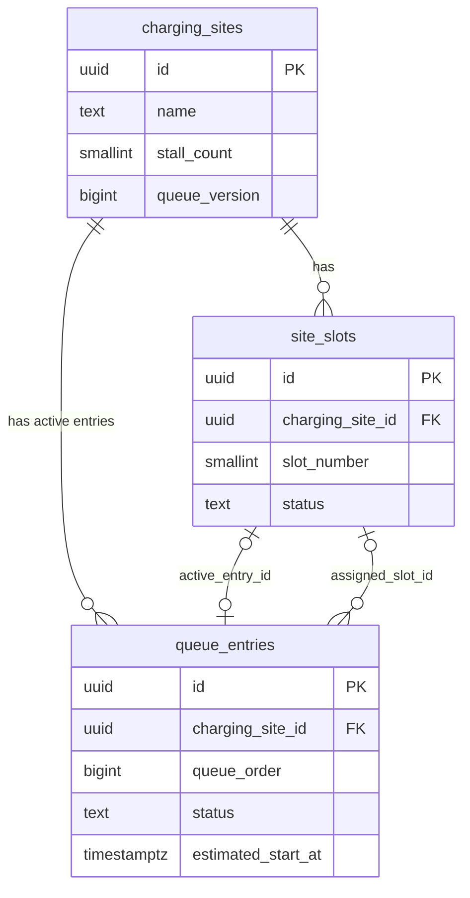

# データベーススキーマ定義

## 1. 目的と前提

このスキーマはSupabase Postgres向けである。待ち列を正しく計算するために必要な**現在の状態だけ**を保存し、充電完了・退出・失効した利用者の履歴は保持しない。

- 利用者アカウント、電話番号、メールアドレス、通知履歴、充電履歴テーブルは作らない。
- 管理トークンの原文はDBへ保存しない。SHA-256ハッシュだけを`queue_entries`へ保存する。
- 待ち時間・状態遷移の業務ロジックはNext.jsサーバー側TypeScriptが担当する。DBは状態の保存、制約、インデックス、施設単位の行ロックを担う。
- ブラウザから基礎テーブルを直接参照・更新しない。すべての操作はRoute Handlerを経由する。

実行用migrationは[20260722000000_initial_queue_schema.sql](/Users/haruki.shimo/Documents/tesla_supercharger/supabase/migrations/20260722000000_initial_queue_schema.sql)と、private Realtime用の[20260722010000_private_realtime_broadcast.sql](/Users/haruki.shimo/Documents/tesla_supercharger/supabase/migrations/20260722010000_private_realtime_broadcast.sql)である。

## 2. ER構造

`active_entry_id`は、現在そのストールを使っている、または呼び出されている利用者だけを示す。`assigned_slot_id`は待ち時間計算での仮割当も含むため、同じストールを複数の待機者が将来枠として参照してよい。

## 3. テーブル定義

### 3.1 `charging_sites` — 施設マスタと施設単位の状態

| カラム | 型 | NULL | Default | 定義 |
|---|---|---:|---|---|
| `id` | `uuid` | No | `gen_random_uuid()` | 施設ID（PK） |
| `name` | `text` | No | — | 施設表示名 |
| `address` | `text` | No | — | 住所 |
| `prefecture` | `text` | Yes | — | 都道府県 |
| `municipality` | `text` | Yes | — | 市区町村 |
| `normalized_search_text` | `text` | No | — | 正規化済み検索文字列 |
| `stall_count` | `smallint` | No | — | ストール数。1〜128 |
| `default_charge_minutes` | `smallint` | No | `45` | 待ち列新規開始時・未確定時の暫定計算値。5〜120 |
| `queue_enabled` | `boolean` | No | `true` | 待ち列の受付可否 |
| `queue_version` | `bigint` | No | `0` | 施設内の状態変更ごとにTSが1増やすversion |
| `queue_started_at` | `timestamptz` | Yes | — | 有効な待ち列が0人から開始した時刻 |
| `source_url` | `text` | Yes | — | 施設情報の確認元URL |
| `source_checked_at` | `timestamptz` | Yes | — | 施設情報の確認日 |
| `created_at` | `timestamptz` | No | `now()` | 作成時刻 |
| `updated_at` | `timestamptz` | No | `now()` | 更新時刻。DBの共通triggerで更新 |

### 3.2 `site_slots` — ストール容量と現在の割当状態

ストールの実番号を外部データから得られない施設でも、`stall_count`分の仮想スロットを作る。

| カラム | 型 | NULL | Default | 定義 |
|---|---|---:|---|---|
| `id` | `uuid` | No | `gen_random_uuid()` | スロットID（PK） |
| `charging_site_id` | `uuid` | No | — | `charging_sites.id`へのFK |
| `slot_number` | `smallint` | No | — | 施設内の連番。施設ごとに一意 |
| `status` | `text` | No | `unknown` | `available` / `occupied` / `called` / `unknown` |
| `active_entry_id` | `uuid` | Yes | — | 現在その枠を使用・呼出中の有効な`queue_entries.id` |
| `estimated_available_at` | `timestamptz` | Yes | — | 次に空く見込み時刻。待ち列なしならNULL可 |
| `estimate_source` | `text` | No | `system` | `default` / `user_input` / `system` |
| `created_at` | `timestamptz` | No | `now()` | 作成時刻 |
| `updated_at` | `timestamptz` | No | `now()` | 更新時刻 |

### 3.3 `queue_entries` — 有効な待ち列エントリーだけ

`completed`、`cancelled`、`expired`は状態値として保存しない。後続を更新した同一トランザクション内で行を削除する。

| カラム | 型 | NULL | Default | 定義 |
|---|---|---:|---|---|
| `id` | `uuid` | No | `gen_random_uuid()` | 待ち列ID（PK） |
| `charging_site_id` | `uuid` | No | — | `charging_sites.id`へのFK |
| `queue_order` | `bigint identity` | No | 自動採番 | FIFOの同時刻タイブレーク。`joined_at, queue_order`で並べる |
| `management_token_hash` | `bytea` | No | — | 管理トークン原文のSHA-256（32 bytes） |
| `nickname` | `text` | No | — | 1〜30文字。表示用だけに使用 |
| `status` | `text` | No | `waiting` | `waiting` / `notified` / `called` / `charging` |
| `joined_at` | `timestamptz` | No | `now()` | 参加時刻 |
| `estimated_start_at` | `timestamptz` | Yes | — | TS再計算で保存する推定開始時刻 |
| `estimate_confidence` | `text` | No | `unknown` | `confirmed` / `provisional` / `unknown` |
| `assigned_slot_id` | `uuid` | Yes | — | 同じ施設内に限る、TS計算による仮割当先`site_slots.id` |
| `called_at` | `timestamptz` | Yes | — | 順番到来時刻 |
| `call_expires_at` | `timestamptz` | Yes | — | 呼出期限。`called_at + 5分` |
| `charging_started_at` | `timestamptz` | Yes | — | 充電開始報告時刻 |
| `initial_charge_minutes` | `smallint` | Yes | — | S-11で1回だけ確定した初回充電時間。5〜120 |
| `duration_confirmed_at` | `timestamptz` | Yes | — | 初回充電時間を確定した時刻 |
| `expected_finish_at` | `timestamptz` | Yes | — | 現在の終了予定。延長時に更新する待ち時間計算の基準値 |
| `finish_confirmation_expires_at` | `timestamptz` | Yes | — | `expected_finish_at + 5分`の自動完了期限 |
| `push_opt_in` | `boolean` | No | `false` | Web Push希望有無 |
| `push_subscription_id` | `text` | Yes | — | OneSignal匿名Subscription ID。有効中だけ保持 |
| `five_min_push_sent_at` | `timestamptz` | Yes | — | 順番5分前通知の送信済み時刻 |
| `called_push_sent_at` | `timestamptz` | Yes | — | 順番到来通知の送信済み時刻 |
| `charge_end_push_sent_at` | `timestamptz` | Yes | — | 終了予定3分前確認の送信済み時刻 |
| `join_idempotency_key_hash` | `bytea` | Yes | — | 参加再送キーのSHA-256。平文キーは保存しない |
| `join_idempotency_fingerprint_hash` | `bytea` | Yes | — | 参加bodyのSHA-256。同じキーで異なる入力を拒否する |
| `last_mutation_key_hash` | `bytea` | Yes | — | 最後の状態変更再送キーのSHA-256 |
| `last_mutation_fingerprint_hash` | `bytea` | Yes | — | 最後の状態変更bodyのSHA-256 |
| `last_mutation_at` | `timestamptz` | Yes | — | 状態変更再送の有効期限判定時刻（10分） |
| `created_at` | `timestamptz` | No | `now()` | 作成時刻 |
| `updated_at` | `timestamptz` | No | `now()` | 更新時刻 |

## 4. 制約とインデックス

### 制約

- `charging_sites.stall_count`: 1〜128。
- `charging_sites.default_charge_minutes`: 5〜120。
- `charging_sites.source_url`: NULL以外は一意にする。公式施設URLをseedの再実行・更新時の安定した識別子として使う。
- `site_slots`: `(charging_site_id, slot_number)`を一意にする。
- `queue_entries.assigned_slot_id`と`site_slots.active_entry_id`は、必ず同じ`charging_site_id`の行だけを参照できる複合FKにする。
- `site_slots.active_entry_id`: NULL以外は一意にする。同じ利用者を複数ストールへ割り当てない。
- `queue_entries.management_token_hash`: SHA-256の32 bytesだけを許可する。
- 冪等性ハッシュ4種もNULLまたは32 bytesだけを許可し、完了・退出・失効時のエントリー削除と同時に消える。
- `queue_entries.nickname`: 1〜30文字。
- `queue_entries.initial_charge_minutes`: NULLまたは5〜120。
- `initial_charge_minutes`と`duration_confirmed_at`: どちらもNULL、またはどちらも非NULL。
- `called`状態は、割当スロット・呼出時刻・呼出期限を必須とする。
- `charging`状態は、割当スロット・開始時刻・終了予定・自動完了期限を必須とする。

### インデックス

| Index | 対象 | 用途 |
|---|---|---|
| `charging_sites_normalized_search_idx` | `normalized_search_text` | 施設検索 |
| `charging_sites_source_url_unique_idx` | `source_url`（NULL以外） | 公式施設URLをキーにした安全なseed更新 |
| `site_slots_site_status_idx` | `charging_site_id, status` | 施設ロック後のスロット取得 |
| `queue_entries_site_fifo_idx` | `charging_site_id, status, joined_at, queue_order` | FIFO再計算 |
| `queue_entries_site_estimate_idx` | `charging_site_id, estimated_start_at` | 施設の待ち時間取得 |
| `queue_entries_called_due_idx` | `call_expires_at`（`called`だけ） | 失効Cron |
| `queue_entries_finish_due_idx` | `finish_confirmation_expires_at`（`charging`だけ） | 自動完了Cron |
| `queue_entries_five_min_due_idx` | `estimated_start_at`（未送信の`waiting/notified`だけ） | 5分前通知Cron |
| `queue_entries_end_notice_due_idx` | `expected_finish_at`（未送信の`charging`だけ） | 終了3分前通知Cron |

## 5. RLSとアクセス方針

- 3テーブルすべてでRLSを有効にする。
- `public`、`anon`、`authenticated`からのSELECT / INSERT / UPDATE / DELETEはすべて禁止する。Supabase Authを使わないため、ブラウザへテーブル権限を渡さない。migrationは通常のPostgresで検証できるよう、Supabase固有ロールが存在するときだけ個別に権限を剥奪する。
- `GET /api/sites`と`GET /api/sites/:siteId/summary`は、Route Handlerが安全な項目だけを返す。
- 待ち列の本人確認、書き込み、施設単位の`SELECT ... FOR UPDATE`は、`SUPABASE_DATABASE_URL`を持つサーバー側TypeScriptだけが行う。
- Realtime Broadcastは`siteId`と`queueVersion`だけを送る。基礎テーブルの行・ニックネーム・管理トークンハッシュは配信しない。
- `realtime.messages`はprivate channel用に、`anon`のBroadcast受信（SELECT）だけを許可する。ブラウザからのBroadcast送信（INSERT）は許可しない。

## 6. 更新責務

| 変更者 | 書き込む主なカラム | ルール |
|---|---|---|
| 施設migration / seed | `charging_sites`、`site_slots` | 管理者PCでmigration作成・レビュー後に適用 |
| `POST /api/queue/join` | `queue_entries`、必要なら`site_slots` | 待ち人数0人から新規開始する時だけ満車確認と45分初期化 |
| 開始・初回時間・延長・完了・退出API | `queue_entries`、`site_slots`、`queue_version` | 同一施設をロックし、TSで再計算後に保存 |
| 外部スケジューラー | 期限・送信済み時刻・失効・自動完了 | 状態条件と送信済み時刻で冪等に実行 |
| DB trigger | `updated_at`、private Realtimeの`queue_changed` | 待ち時間・状態遷移の業務ロジックを持たない。`queue_version`確定後の通知だけを送る |

## 7. 初期データ投入

1. `charging_sites`へ確認済みの施設情報をupsertする。
2. 各施設の`stall_count`に合わせて`site_slots`を1〜Nで作成する。
3. 新規施設は待ち列が0人のため、`site_slots.status = 'unknown'`、`estimated_available_at = NULL`で開始する。
4. 利用者が現地満車を確認して待ち列を新規開始した時だけ、確定終了時刻を持たないスロットを`status = 'occupied'`、`estimated_available_at = now() + default_charge_minutes`、`estimate_source = 'default'`で初期化する。

`queue_entries`をseedへ含めない。利用者データは実際の参加時だけ作成し、終了時に削除する。
