# 実装計画書

## 1. 目的

本書は、スパQのMVPをウォーターフォール型で実装するための作業指示書である。各実装担当が「何を作るか」「どこまで作れば完了か」「何をしてはいけないか」を同じ基準で判断できるようにする。

各工程は、前工程の出口条件を満たして凍結されるまで次へ進まない。全工程の実装を完了・凍結した後に、Red Team、Blue Team、Purple Teamが総合レビューする。

エージェントの担当と最終レビューの仕組みは、[coding-agent-structure.md](/Users/haruki.shimo/Documents/tesla_supercharger/docs/coding-agent-structure.md)を正とする。

## 2. 実装の前提と全工程の共通禁止事項

### 実装の前提

- 技術構成はNext.js App Router + TypeScript、Vercel、Supabase Postgres、Supabase Realtime Broadcast、OneSignal Web Push、Cloudflare Turnstile候補とする。
- 利用者・運用者のログイン機能、Supabase Auth、電話番号、SMS、メール認証は実装しない。
- 有効な待ち列データだけを保持し、完了・取消・失効時に`queue_entries`を削除する。
- 待ち時間計算・状態遷移の業務ロジックはサーバー側TypeScriptに置く。SQLはDB制約、トランザクション、ロック、データ保存に限定する。
- 施設検索は、日本国内152施設・752ストールの登録データを用いる。入力ごとにサーバー検索をしない。
- Teslaとのリアルタイム連携は行わない。画面と現地の状況が違う場合は現地を優先する。

### 全工程でしてはいけないこと

- 仕様書にないログイン、利用者履歴、SMS、地図、管理画面、独立したバックエンドを追加しない。
- `SUPABASE_DATABASE_URL`、OneSignal REST API Key、Turnstile Secret Key、管理トークン原文をクライアント、URL、ログ、ソース管理へ出さない。
- ブラウザから`charging_sites`、`site_slots`、`queue_entries`を直接読み書きさせない。
- 完了済みmigrationを変更しない。DB変更は新しいmigrationだけで行う。
- 初回充電時間を確定後に任意変更可能にしない。延長は終了予定3分前の確認画面からだけ許可する。
- 画面表示だけの見かけの更新で、待ち列の順序・スロット・期限を変更しない。
- 実装担当の判断だけで、API契約・DBスキーマ・画面遷移・通知種類を変更しない。

## 3. 工程の全体像

```mermaid
flowchart LR
  P0[IP-00: 計画凍結] --> P1[IP-01: 基盤]
  P1 --> P2[IP-02: DB・初期データ]
  P2 --> P3[IP-03: 待ち列ドメイン]
  P3 --> P4[IP-04: Route Handler・Cron]
  P4 --> P5[IP-05: 画面・PWA]
  P5 --> P6[IP-06: 統合]
  P6 --> F[IP-07: 実装凍結]
  F --> R1[RV-01: Red Team]
  R1 --> R2[RV-02: Blue Team]
  R2 --> R3[RV-03: Purple Team]
  R3 --> D[運営者が本番反映]
```

| ID | 担当 | 工程 | 主な成果物 |
|---|---|---|---|
| IP-00 | A0 | 計画凍結 | 実装対象・正本資料・変更ルール |
| IP-01 | A1 | 基盤 | Next.js、設定テンプレート、テスト基盤 |
| IP-02 | A1 | DB・初期データ | migration、seed、RLS、152施設 |
| IP-03 | A2 | 待ち列ドメイン | 純粋TS計算、状態遷移、単体試験 |
| IP-04 | A2 | サーバー機能 | Route Handler、Cron、Realtime、Push送信 |
| IP-05 | A3 | 画面・PWA | S-01〜S-18、検索、通知許可、カウントダウン |
| IP-06 | A2 + A3 | 統合 | API接続、Realtime、E2E、エラー表示 |
| IP-07 | A0 | 実装凍結 | 対象commit、設定一覧、テスト証跡 |
| RV-01 | R1 | Red Team | 攻撃・破綻レビュー報告 |
| RV-02 | R2 | Blue Team | 防御・復旧・運用レビュー報告 |
| RV-03 | R3 | Purple Team | 指摘突合・最終判定書 |

## 4. 実装工程

### IP-00: 計画・仕様の凍結

**担当:** A0

**ゴール**

実装担当が参照する資料、実装範囲、担当ファイル、工程順、受入基準を固定する。

**実装・作成するもの**

- 本書、エージェント構成、要件、技術要件、画面遷移、DB、API、Realtime、エラー、デザイン、利用規約、施設データの正本一覧。
- リポジトリのブランチ・PR・commit規約、担当ごとの所有範囲。
- 仕様に未記載の値を運営者へ確認する一覧。例：Supabase / Vercel / OneSignal / Turnstileの実値、運営者情報、プライバシーポリシーURL。

**完了条件**

- [requirements-definition.md](/Users/haruki.shimo/Documents/tesla_supercharger/docs/requirements-definition.md)のMVP範囲と、[technical-requirements.md](/Users/haruki.shimo/Documents/tesla_supercharger/docs/technical-requirements.md)の技術方針に矛盾がない。
- API、DB、画面遷移の各正本が存在し、実装担当へリンクで渡せる。
- 未確定の外部サービス実値を、コードで仮定しない方針が明記されている。
- 次工程以降の担当が、自身の作業範囲・出口条件・禁止事項を説明できる。

**してはいけないこと**

- 便利そうという理由だけで、機能や外部サービスを追加しない。
- 不明なポリシー・運営者情報・秘密情報をダミーのまま本番仕様として確定しない。
- 実装に入ってからDB・APIの正本を作り直さない。

### IP-01: Next.js基盤・開発基盤

**担当:** A1

**ゴール**

安全なNext.jsアプリの土台を作り、以降の担当が同じコマンドで開発・検証・production buildできる状態にする。

**実装するもの**

- Next.js App Router + TypeScriptのプロジェクト、Lint、型検査、テスト実行、production build。
- サーバー専用DB接続と、公開してよい環境変数だけを分ける設定。
- `.env.example`、Vercel設定、Vercel Cronの設定枠、運営者が行うデプロイ後確認手順。
- 共通のエラー応答形式、HTTPヘッダー、秘密情報をマスクするログ方針。
- `README.md`に、起動・検証・環境変数の設定手順を記載する。

**完了条件**

- 依存関係のインストール後、Lint、型検査、テスト、production buildが成功する。
- `.env.example`だけで必要な変数名と公開・非公開の別が分かる。
- `NEXT_PUBLIC_*`に秘密情報がなく、サーバー専用モジュールをClient Componentからimportできない。
- production buildが成功し、`.env.example`とREADMEだけで運営者がVercel設定を行える。意図しない環境変数がクライアントバンドルへ露出しない。

**してはいけないこと**

- 実際の秘密情報を`.env.example`、テストfixture、コミット、画面へ書かない。
- 独自Express / Railsサーバーや、常時稼働ワーカーを追加しない。
- この工程で待ち列の業務ロジックやUIを先行実装しない。

### IP-02: Supabaseスキーマ・初期施設データ

**担当:** A1

**ゴール**

施設・仮想ストール・有効待ち列だけを、安全に保存できるDBを作る。日本国内152施設・752ストールをレビュー可能な形で登録する。

**実装するもの**

- [database-schema.md](/Users/haruki.shimo/Documents/tesla_supercharger/docs/database-schema.md)に一致するSupabase migration。
- RLS、有効な制約、索引、`updated_at` trigger、施設単位でのロックに必要なDB構成。
- [20260722_japan_superchargers.sql](/Users/haruki.shimo/Documents/tesla_supercharger/supabase/seed/20260722_japan_superchargers.sql)による施設seed。
- 空の検証DBに適用するスクリプトまたは手順と、件数・ストール数を検査するSQL。

**完了条件**

- 空の検証DBへmigrationとseedを適用できる。
- `charging_sites = 152`、`sum(stall_count) = 752`、`site_slots = 752`となる。
- DB基礎テーブルはpublic / anon / authenticatedから直接操作できない。
- `source_url`をキーにseedを再実行しても同じ施設が重複作成されない。
- 完了・取消・失効後の履歴テーブルやユーザーテーブルを作らない。

**してはいけないこと**

- 本番DBへの適用を、この工程の完了条件に含めない。本番反映はPurple Team承認後だけに行う。
- 現地の実ストール番号が不明な施設に、根拠のない実番号を登録しない。仮想スロット連番を使う。
- 有効な待ち列がある施設で、ストール数を減らすseedを自動適用しない。
- RLSを無効化して、ブラウザ直アクセスで実装を簡略化しない。

### IP-03: 待ち列ドメイン・待ち時間計算

**担当:** A2

**ゴール**

HTTP、DB、Pushから独立したTypeScriptの待ち列計算と状態遷移を実装し、全ライフサイクルを決定論的に扱えるようにする。

**実装するもの**

- `lib/queue/recalculate.ts`等の純粋関数。スロットの次回空き時刻を最小ヒープで扱い、FIFO順に推定開始時刻・仮割当を決める。
- `waiting`、`notified`、`called`、`charging`の遷移ルール。
- 参加、退出、呼出、開始、初回時間確定、延長、完了、呼出失効、自動完了の各イベント処理。
- 45分fallback、初回入力の5〜120分、終了予定3分前の延長、終了予定5分後の自動完了の期限計算。
- 単体試験。3 / 4ストール、同時空き、待ちなし、新規待ち列開始、同時刻FIFO、確定時間、延長、期限境界を含める。

**完了条件**

- [queue-recalculation-spec.md](/Users/haruki.shimo/Documents/tesla_supercharger/docs/queue-recalculation-spec.md)の再計算発火条件をすべてテストできる。
- 4ストールの例で、現在15:20・空き予定15:30 / 15:45 / 15:45 / 15:45の場合、A=10分、B/C/D=25分となる。
- 時間未確定の利用者には45分を使い、確定後はその値を使って後続を即時再計算する。
- 初回時間の二度目の確定、期限外の開始・延長は明確なエラーとして拒否される。
- 計算関数は現在時刻を引数で受け取り、テストが実時間へ依存しない。

**してはいけないこと**

- 計算本体をSQLのtrigger、stored procedure、Route Handler、React Componentに埋め込まない。
- 充電開始後に、利用者が任意の時点で残り時間を変更できる仕様にしない。
- Teslaの実際のストール空き状況を推測・取得して計算へ混ぜない。
- 完了・取消・失効の利用者を履歴目的で残さない。

### IP-04: Route Handler・トランザクション・Cron・通知送信

**担当:** A2

**ゴール**

待ち列ドメインを安全なサーバー処理として公開し、同時操作と時刻到来を正しく処理する。

**実装するもの**

- `POST /api/queue/join`、`GET /api/queue/me`、`cancel`、`start`、`duration`、`extend`、`complete`、`push-subscription`。
- `GET /api/sites`、施設概要・本人状態取得の、安全な表示用データ取得。
- 256bit以上の管理トークン発行、SHA-256ハッシュ照合、トークン原文を返すのは参加直後の一度だけとする処理。
- 施設行と対象スロットの`SELECT ... FOR UPDATE`、状態確認、TypeScript再計算、保存、`queue_version`更新を1トランザクションで行う処理。
- Vercel Cronから呼ぶ期限処理。5分前通知、呼出5分失効、終了3分前確認、終了予定5分後の自動完了。
- Supabase Realtimeの施設単位`queue_changed` Broadcastと、OneSignalの3種類のPush送信。
- Turnstile token検証、IP・施設単位のRate Limitの実装枠。

**完了条件**

- [api-contract.md](/Users/haruki.shimo/Documents/tesla_supercharger/docs/api-contract.md)の成功・失敗JSON、HTTP status、エラーコードに一致する。
- 同じリクエストの再送、Cronの重複起動、同時完了でも、行の二重削除・二重Push・順番の逆転を起こさない。
- `Idempotency-Key`はクライアントが操作単位で再利用し、active `queue_entries`にはキー/fingerprintのハッシュだけを一時保存する。参加の管理トークンはserver-only HMACから再送時に復元し、平文をDBへ保存しない。
- 施設が変わる操作は、対象施設だけをロックし、別施設の待ち列を不必要に止めない。
- 期限処理後に、呼出・自動完了の対象行が残らず、後続が計算・通知される。
- Realtime payloadは`siteId`と`queueVersion`だけであり、個人データを含まない。
- Pushを利用しない利用者でも、すべてのAPI操作を完了できる。

**してはいけないこと**

- 管理トークン、DB接続文字列、OneSignal REST API Keyをレスポンス・例外・Push本文へ含めない。
- ブラウザへSupabaseの書込み権限やservice keyを渡さない。
- 各順位変更・参加・取消ごとにPushを送らない。Pushは5分前、順番到来、終了3分前確認の3種類だけである。
- Cronの実行回数だけで状態を判断しない。DBの状態・送信済み時刻・期限を条件に冪等に処理する。

### IP-05: 画面・検索・PWA

**担当:** A3

**ゴール**

現在のMockと[DESIGN.md](/Users/haruki.shimo/Documents/tesla_supercharger/DESIGN.md)を基準に、待ち列の全利用者動線をスマホ優先で実装する。

**実装するもの**

- [screen-flow-spec.md](/Users/haruki.shimo/Documents/tesla_supercharger/docs/screen-flow-spec.md)のS-01〜S-18を、[DESIGN.md](/Users/haruki.shimo/Documents/tesla_supercharger/DESIGN.md)のレスポンシブ基準に従って実装する。
- NFKC・空白・大小文字を正規化した、152施設を対象とするクライアント内検索。前方一致を優先し、最大20件、100ms目標で候補を更新する。
- 待ち時間0分でも現地満車なら待ち列開始を選択できる満車確認画面。
- ニックネーム、利用規約同意、待ち人数、推定待ち時間、現地優先案内、退出、充電開始、初回時間入力、延長・完了選択、結果画面。
- `estimated_start_at`から減算表示する画面内カウントダウン。サーバー再計算は行わない。
- OneSignalの任意通知許可UI、通知拒否時の案内、iPhone/iPadのホーム画面追加案内、manifest、Service Worker。
- [error-catalog.md](/Users/haruki.shimo/Documents/tesla_supercharger/docs/error-catalog.md)のエラー文言、再試行、復旧不可画面。

**完了条件**

- 利用者が「検索→施設選択→満車確認→参加→待機→呼出→開始→時間確定→終了または延長→完了」を操作できる。
- 待機中に、前にいる人数・推定待ち時間・画面内カウントダウン・現地優先案内を確認できる。
- 参加時にニックネームと利用規約同意が必須で、電話番号入力はない。
- 初回充電時間の入力は30分を選択済みで表示され、5〜120分の範囲だけを確定できる。
- 予定終了3分前は終了・延長を提示し、予定終了5分後かつ後続待機者がいる場合は「後ろに待っている人がいるのでどいてあげましょう」の趣旨を強く表示する。
- 通知拒否、非対応、オフライン表示でも、誤解のない導線と再試行を提供する。
- レスポンシブ対応を必須とし、`320px`、`360px`、`390px`、`430px`幅、およびモバイル縦横・ソフトウェアキーボード表示時に、横スクロール、表示欠け、操作不能なCTAがない。

**してはいけないこと**

- Mockの情報設計・デザインルールを、実装都合だけで大幅に変えない。
- 検索のキー入力ごとにAPIを呼ばない。
- 他人のニックネーム、待ち列ID、管理トークンを表示・保存・共有しない。
- 画面側だけで状態を成功扱いにしない。操作結果は必ずサーバー応答を正とする。
- Push許可を初回アクセス直後や強制的なモーダルで要求しない。

### IP-06: 統合・自動試験

**担当:** A2 + A3

**ゴール**

サーバー処理・画面・Realtime・Cron・任意通知を結び、想定利用者動線を検証環境で最後まで通せるようにする。

**実装するもの**

- APIクライアント、管理トークンの同一origin `localStorage`保持・終端時削除、本人状態の再取得。
- `site:<siteId>`のRealtime受信、`queueVersion`変化後の再取得、10〜15秒polling、再接続時再同期。
- 通知許可後のPush Subscription登録、通知未許可時の機能継続。
- 実時刻を固定できるCron・期限処理の統合テスト。
- Playwright等による主要E2E。複数ブラウザ文脈で同時参加・同時完了を扱う。
- `320px`、`360px`、`390px`、`430px`幅、モバイル縦横、Android、iPhone/iPad想定、通知拒否、通信切断・復帰の試験。

**完了条件**

- 主要動線と例外動線がAPIのmockではなく検証用Supabase DBを使って通る。
- Realtime不通時もpollingで本人状態を再同期できる。
- Pushは任意であり、拒否しても参加・開始・完了・退出を妨げない。
- 複数利用者の同時操作で、1つのスロットへ複数の`called` / `charging`が割り当たらない。
- 指定した全モバイル幅・向きで、横スクロール、文字切れ、セーフエリアとの重なり、キーボード表示による操作不能がない。
- [requirements-definition.md](/Users/haruki.shimo/Documents/tesla_supercharger/docs/requirements-definition.md)のAC-001〜AC-011の自動または手動の試験証跡がある。

**してはいけないこと**

- 実装の都合で、検証環境と本番だけで異なる業務ロジックを持たせない。
- 通知を受けたことを状態遷移の前提にしない。
- テストのためにRLS、CAPTCHA、トークン検証、期限処理を恒久的に無効化しない。
- テストデータのニックネーム・トークン・Push IDを本番へ流入させない。

### IP-07: 実装凍結

**担当:** A0

**ゴール**

総合レビューの対象を1つの状態に固定し、レビュー中の仕様追加・無関係な変更を防ぐ。

**作成するもの**

- レビュー対象commit / tag、対象ブランチ、migration一覧、seedのハッシュ、環境変数名一覧。
- IP-01〜IP-06の完了条件、テスト結果、既知の制約、未確定外部設定をまとめた実装凍結記録。
- Red / Blue / Purple Teamへ渡す検証URL、テストアカウントではない匿名操作手順、データ初期化手順。

**完了条件**

- Lint、型検査、単体試験、統合試験、E2E、production buildがすべて成功している。
- レビュー対象のcommit以外に未承認変更がない。
- 実装担当が、既知の制約（現地優先、Push非保証、ブラウザデータ削除時の復旧不可）を文書化している。

**してはいけないこと**

- Red / Blue / Purple Teamのレビュー中に、範囲外の改善や機能追加を入れない。
- 未実装の外部サービスを「後で設定する」だけで完了扱いにしない。
- 本番環境をレビュー用の実験場として使わない。

## 5. 最終レビュー工程

最終レビューの詳細な役割は[実装エージェント構成・分担計画](/Users/haruki.shimo/Documents/tesla_supercharger/docs/coding-agent-structure.md)のR1〜R3を正とする。本書では、工程の入口・出口を定義する。

### RV-01: Red Teamレビュー

**ゴール:** 不正操作、情報漏えい、競合、期限境界、通信障害で利用者の順番・データ・安全性が壊れないかを発見する。

**入口条件:** IP-07の実装凍結記録がある。

**出口条件:** Critical / Highの全件について、再現証跡と修正要求が作成されている。未解決なら次工程へ進めない。

**してはいけないこと:** 指摘を口頭・曖昧な文章だけで閉じない。修正を自ら実装して自己承認しない。

### RV-02: Blue Teamレビュー

**ゴール:** 防御、復旧、運用設定、エラー表示、通知なしでの継続、受入条件を満たすか確認する。

**入口条件:** Red Teamの報告と、対象修正のcommit・試験結果がある。

**出口条件:** Critical / Highが0件。Mediumは運営者の受容判断、Lowは既知課題記録を持つ。防御・復旧・運用チェックリストがPASSである。

**してはいけないこと:** Red Teamの試験をそのままなぞるだけで防御確認を終えない。環境変数やCronなど本番設定を未確認のままPASSにしない。

### RV-03: Purple Teamレビュー

**ゴール:** Redの攻撃経路とBlueの対策が実際に一致し、修正が回帰を起こしていないことを最終確認する。

**入口条件:** Red / Blueの報告、修正commit、再試験証跡がすべて揃う。

**出口条件:** 必須受入条件がすべてPASS、Critical / Highが0、Mediumは明示受容済みであることを確認し、「デプロイ引き継ぎ可」または「引き継ぎ不可」の最終判定書を出す。

**してはいけないこと:** 修正PRの説明だけを信用してPASSにしない。Redの再現手順と通常利用E2Eを再実行せずに承認しない。

## 6. 不具合が見つかった場合の扱い

ウォーターフォール型でも、最終レビューで見つかった不具合は修正する。ただし新しい要望を混ぜず、次の固定手順で扱う。

1. R1またはR2が、再現手順・影響・重大度・対象工程を記録する。
2. A0が、修正担当と影響範囲を決める。仕様変更が必要なら運営者の承認を得て正本資料を更新する。
3. 担当実装者は最小の修正PRを作り、影響する単体・統合・E2Eを再実行する。
4. R1は元の攻撃・破綻シナリオを、R2は防御・復旧を再確認する。
5. R3が回帰を含めて再判定する。

修正のたびに新機能の追加、UIの全面変更、データモデルの拡張は行わない。変更の影響が大きく、IP-00〜IP-06の前提を崩す場合は、実装凍結を解除して該当工程からやり直す。

## 7. 実装担当に渡すタスク指示テンプレート

各タスクは、必ず次の形で担当エージェントへ渡す。これにより、実装対象が曖昧なまま作業を始めない。

~~~text
タスクID:
担当:
前提工程と参照資料:
所有してよいファイル:

ゴール:
- 利用者またはシステムが達成できる状態

実装対象:
- 作る画面、関数、Route Handler、migration、テスト

完了条件:
- 実行するコマンド、期待値、確認画面、証跡

してはいけないこと:
- 仕様外の機能、触れてはいけないファイル、秘密情報の扱い

引き継ぎ内容:
- 変更ファイル、実行結果、既知の制約、次工程への入力
~~~

担当エージェントは、完了時に「ゴール」「完了条件」「禁止事項」に対してそれぞれPASS / 未達を報告する。未達が1つでもある場合は、次工程へ引き渡さない。

## 8. 運営者による本番反映の最終条件

本番反映は運営者が行う。AIは次を満たした引き継ぎ資料を作成し、運営者が確認してから反映する。

- Purple Teamが「デプロイ引き継ぎ可」と判定している。
- 反映するcommit、migration、seed、環境変数名、Vercel Cron設定が実装凍結記録と一致する。
- Supabase、Vercel、OneSignal、Turnstileの本番設定を運営者が確認できる手順がある。未導入の任意機能は、機能を無効化した安全な挙動を確認する。
- 利用規約・プライバシーポリシーの運営者情報と公開URLが確定している。
- 本番seedを適用する運営者承認があり、対象施設に有効な待ち列がない。
- 反映後に実施する最低限の動作確認、ロールバック判断、問い合わせ窓口が定義されている。
