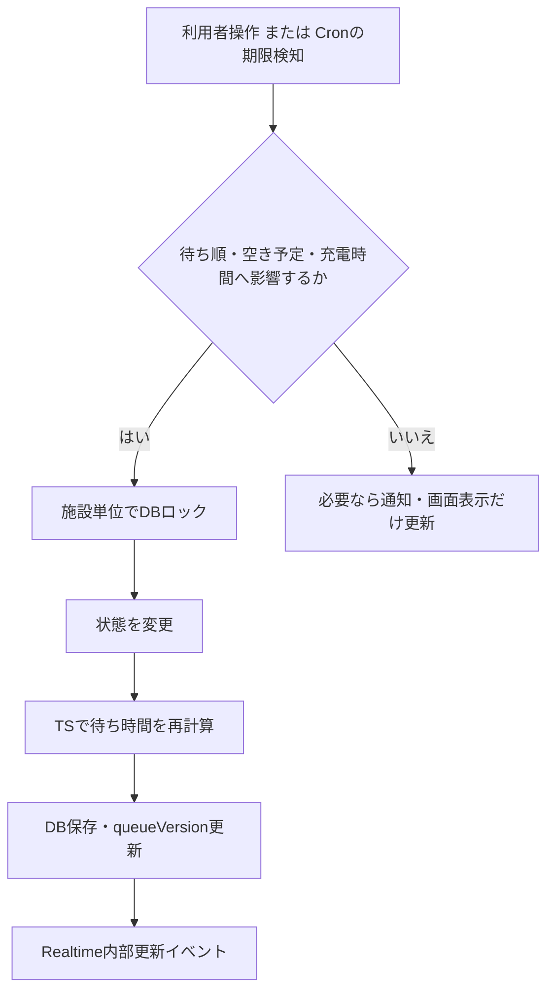

# 待ち時間再計算の発火仕様

## 結論

待ち時間は、**待ち順・ストールの空き予定・充電時間のいずれかに影響する情報が変わった時だけ**、サーバー側TypeScriptで再計算する。

すべての情報更新で再計算するわけではない。Pushの送信済み時刻や「順番の5分前」状態だけが変わっても、待ち順と空き予定が変わらないため再計算しない。

## 再計算する発火条件

| 発火元 | 条件 | 変わる情報 |
|---|---|---|
| 待ち列参加 | 利用者が参加を確定する | 待ち列末尾への追加、推定開始時刻 |
| 待ち列の新規開始 | アプリ上の有効な待機者が0人で、現地満車を確認して参加する | 不明なストールを暫定45分で初期化、待ち列開始 |
| 待ち列退出 | 利用者が自身で退出する | 後続の順位、推定開始時刻 |
| 充電開始 | `called`の利用者が5分以内に開始を報告する | ストール状態、終了予定のfallback、後続予測 |
| 初回の充電時間確定 | 充電開始後に5〜120分を1回だけ確定する | そのストールの終了予定、後続予測 |
| 延長 | 追加時間を確定する | 終了予定、後続予測 |
| 充電完了 | 利用者が完了を報告する | ストール解放、次の呼び出し、後続予測 |
| 呼び出し失効 | 呼び出し後5分以内に開始報告がない | 対象行の削除、次の呼び出し、後続予測 |
| 自動完了 | 予定終了時刻の5分後まで無応答 | ストール解放、次の呼び出し、後続予測 |
| 施設マスタ変更 | ストール数・標準充電時間をmigrationで変更する | 対象施設に有効な待ち列があれば全体を再計算 |

複数ストールが同時に空いた場合は、空いた数だけFIFO先頭の利用者を同一トランザクションで`called`にする。その後に残った待機者を再計算する。

## 再計算しない更新

| 更新 | 理由 | 行うこと |
|---|---|---|
| 順番の約5分前になった | 順位・空き予定を変えない | 画面内通知・Web Push。必要なら`notified`表示のみ更新 |
| 予定終了時刻の3分前になった | 延長・完了がまだ選ばれていない | 延長・終了確認のポップアップ・Web Push |
| 初回の充電時間確定後に任意変更しようとする | 待ち時間を不安定にしないため許可しない | `INVALID_QUEUE_STATE`として拒否し、終了予定3分前の確認を案内 |
| Push送信済み時刻の記録 | 待ち時間へ影響しない | 二重送信防止用の時刻だけ保存 |
| 現在時刻が進んだ | 推定開始時刻そのものは変わらない | ブラウザで「あと○分」を減算表示 |
| Realtimeイベントを受信した | 計算済みの状態を取得するだけ | 本人状態・施設集計を再取得してReact stateを更新 |

## 処理の手順

再計算が必要なイベントでは、Next.js Route HandlerまたはVercel Cron Handlerが同じ待ち列サービスを実行する。

1. 管理トークン・入力値・現在状態を検証する。
2. DBトランザクションを開始し、対象施設行と対象ストール行を`SELECT ... FOR UPDATE`でロックする。
3. イベントの状態変更を適用する。例：完了なら対象ストールを空きにし、対象エントリーを削除する。
4. 対象施設の有効なストールと待機者を読み込む。
5. TypeScriptで各ストールの次回空き予定を最小ヒープへ入れ、FIFO順に待機者を最も早く空くストールへ仮割り当てする。
6. `estimated_start_at`、割当ストール、参考待ち時間を保存する。
7. `queue_version`を1増やし、トランザクションを確定する。
8. `site:<siteId>`へ`queue_changed`を送る。ブラウザは必要な状態を再取得する。

計算ロジックは`lib/queue/recalculate.ts`などの純粋なTypeScript関数とし、DBアクセス・HTTP・Push送信から分離する。

## Cronの役割

Vercel Cronは1分ごとに期限到来候補を確認する。期限条件に一致した時だけ次の処理を行う。

| 期限 | Cronの処理 | 再計算 |
|---|---|---:|
| 推定呼び出し時刻の約5分前 | 5分前通知を送る | なし |
| 呼び出し後5分 | 失効・行削除・次の呼び出し | あり |
| 予定終了時刻の3分前 | 延長・終了確認を送る | なし |
| 予定終了時刻の5分後 | 自動完了・行削除・次の呼び出し | あり |

Cronは同じイベントを重複して実行しても結果が壊れないように、送信済み時刻、現在状態、DBロックを条件にして冪等に実装する。

## 表示更新との違い

- 再計算: サーバーが待ち順・空き予定を変え、推定開始時刻を保存する処理
- Realtime: 画面へ「施設の情報が変わった」ことを知らせる内部イベント
- 画面カウントダウン: 保存済みの推定開始時刻から、ブラウザが「あと○分」を表示する処理
- Web Push: 利用者に行動が必要な時だけ送る端末通知

Tesla連携は行わないため、アプリ外でストールが空いた・埋まったことだけでは自動発火しない。現地状況を最優先とし、利用者の参加・開始・完了報告を基に再計算する。
