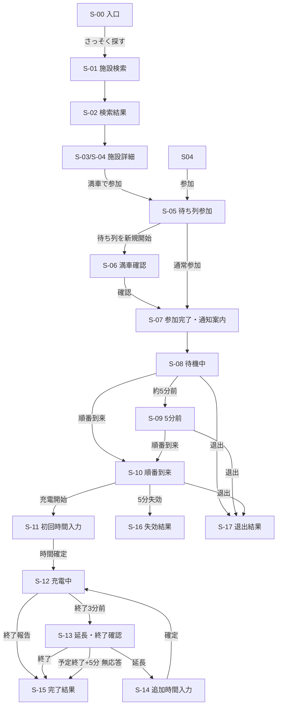

# 画面一覧・画面遷移仕様

## 目的と共通方針

デザインの色、文字、コンポーネント、レスポンシブ方針はプロジェクト直下の`DESIGN.md`を正とする。本書は画面の目的・表示内容・操作・遷移を定義する。

- 既存Mockのモバイル中心、カード型、状態が一目で分かる配色・余白をデザイン基準にする。
- ログイン、電話番号、地図、現在地・距離表示は設けない。
- 画面はページ遷移だけでなく、同一ページ内の状態変化・モーダルも含めて定義する。
- 待ち時間は参考値であり、現地の空き・施設ルール・実際の並び順を最優先する注意書きを待機系画面へ常時表示する。
- 通知許可は待ち列参加後にだけ求め、検索・初回表示時には求めない。

## 画面一覧

| ID | 画面・状態 | 主な表示 | 主な操作 | 到達条件 |
|---|---|---|---|---|
| S-00 | ルート・入口 | スパQ、サービス説明、注意書き | さっそく探す、使い方を見る | 初回アクセス（`/`） |
| S-01 | 施設検索 | 自由入力検索、検索ヒント | 施設名・住所・都道府県を入力 | 初回アクセス、施設検索へ戻る |
| S-02 | 検索結果 | 最大20件の施設名、住所、ストール数 | 施設を選択 | S-01で入力あり |
| S-03 | 施設詳細・待ちなし | 施設情報、「アプリ上の待ちなし（0分）」、現地優先注意 | 満車なら待ち列参加 | 有効な待機者が0人 |
| S-04 | 施設詳細・待ちあり | 施設情報、待ち人数、参考待ち時間、現地優先注意 | 待ち列参加 | 有効な待機者が1人以上 |
| S-05 | 待ち列参加 | ニックネーム入力、参加内容、注意事項、利用規約・プライバシーポリシーの同意 | 参加する、戻る | S-03/S-04から参加を選択 |
| S-06 | 待ち列開始時の満車確認 | 「現地が満車ですか？」確認、45分暫定計算の説明 | 満車を確認して参加、戻る | アプリ上の待ち人数が0人で、現地の待ちを新規に作る場合だけ表示 |
| S-07 | 参加完了・通知案内 | 参加完了、通知の利点、通知許可ボタン、iPhone案内 | 通知を受け取る、後で | 参加API成功後 |
| S-08 | 待機中 | 自分の順位、前方人数、推定待ち時間、推定呼び出し時刻、現地優先注意、退出 | 待ち列から退出、目の前で空きができた | `waiting` |
| S-08a | 現地空き・即時開始確認モーダル | 「周りに並んでいそうな車両はいませんか？」、再計算の説明 | 問題ないので充電を開始する、待機を続ける | S-08/S-09で現地の空きを確認した場合 |
| S-09 | 5分前 | S-08の内容、施設付近へ戻る案内、強調表示 | 待機継続、退出 | `notified`。画面内通知・任意Web Push |
| S-10 | 順番到来・充電開始 | 「順番です」、5分カウントダウン、開始ボタン、退出 | 充電を開始しました、退出 | `called` |
| S-11 | 初回充電時間入力 | 初期値30分、プリセット、5〜120分の自由入力、終了予定 | 時間を確定 | 充電開始報告後。初回のみ |
| S-12 | 充電中 | 終了予定時刻、「充電が終わりました」ボタン、現地優先注意 | 充電を終了 | 初回時間確定後 |
| S-13 | 終了3分前の確認モーダル | 「あと3分」、終了・延長の選択 | 終了、延長する | `expected_finish_at - 3分` |
| S-14 | 延長時間入力モーダル | 追加時間のプリセット、5〜120分の自由入力、新しい終了予定 | 延長を確定、戻る | S-13で延長を選択 |
| S-15 | 完了結果 | 完了または自動完了の結果、現地での移動案内、施設検索へ戻る | 施設を探す | 完了報告または自動完了 |
| S-16 | 呼び出し失効結果 | 5分以内に開始できなかった説明、再参加案内 | 施設詳細へ | `called`期限切れ |
| S-17 | 退出結果 | 待ち列から退出した結果 | 施設を探す | 利用者が退出 |
| S-18 | セッション復旧不可 | ブラウザデータ消去などで操作できない説明 | 施設詳細へ | 管理トークンなし・不一致 |

S-13とS-14は独立ページではなく、S-12の上に出すモーダルとする。初回の充電時間をS-11で確定した後は、S-12から任意に時間を変更する操作を設けない。

## 画面ごとの詳細

### S-00 ルート・入口

- ルート`/`にはブランド名「スパQ」、一言の説明、「さっそく探す」ボタンだけを置く。
- 「さっそく探す」は`/search`へ遷移する。
- 再生マーク付きの「使い方を見る」は、`/charge-queue-mock.mp4`を再生するモーダルを開く。モーダルは閉じるボタン、背景クリック、Escapeで閉じられる。
- 利用規約・プライバシーポリシーへ到達できるリンクを置く。

### S-01 / S-02 施設検索・検索結果

- 入力対象は施設名、住所、都道府県、市区町村とする。
- 入力値の正規化、前方一致優先、部分一致を行う。
- 位置情報・距離順・地図は表示しない。
- 検索結果は入力中に画面内で更新し、施設を選んだ時だけ詳細画面へ進む。

### S-03 / S-04 施設詳細

- 共通表示は施設名、住所、ストール数、受付可否、現地優先の注意書き。
- S-03はアプリ上の待機者がいないことを「待ち時間0分」と表示する。現地の空き状況を保証する表示にはしない。
- S-04は待ち人数と参考待ち時間を表示する。他の利用者のニックネームや位置は表示しない。
- 「満車で待ち列に参加」を主操作とし、空きがある場合は現地で充電するよう案内する。

### S-05 / S-06 待ち列参加

- ニックネームは必須、1〜30文字。電話番号・ログイン入力はない。
- 「利用規約およびプライバシーポリシーに同意する」チェックボックスを未選択で表示し、同意するまで参加ボタンを有効化しない。両文書へ同じ画面から到達できるリンクを置く。
- 利用者に「現地が満車であることを確認したうえで参加する」旨を表示する。
- S-06は、アプリ上の待ち人数が0人の施設で、現地の待ちを新規に作る時だけ表示する。確認後、アプリ上の確定終了時刻がないストールを45分後に空く暫定値として扱う。
- 参加確定時にRoute Handlerが施設をロックして待ち人数0人かを最終確認する。画面表示後に他の利用者が参加していた場合は、満車確認や45分初期化を重複実行せず通常の待ち列参加として処理する。
- CAPTCHAを採用する場合、S-05の参加ボタン付近へTurnstileを表示する。

### S-07 通知案内

- 参加完了直後にだけ「通知を受け取る」を表示する。拒否・後回しでも待ち列機能を利用できる。
- 対象通知は順番5分前、順番到来、終了予定3分前の延長・終了確認。
- iPhone/iPadはホーム画面へ追加する手順を表示し、条件を満たさない場合も待機画面へ進める。

### S-08 / S-09 待機中

- 表示する数値は自分の前にいる人数、推定待ち時間、推定呼び出し時刻、参考値である旨。
- S-09では施設付近へ戻る案内を色・文言・可能な端末では音・振動で強調する。
- Realtimeで数値が変化しても、端末通知を毎回出さず表示だけを更新する。
- 現地で空きが出た場合は「目の前で空きができた」を表示する。S-08aで周囲の並びを確認したうえで確定すると、待機をスキップして充電中へ移行し、ストール割当と後続の待ち時間を再計算する。現地の並びが優先であり、確定前に他の車両が並んでいる場合は使わない。
- 「待ち列から退出」は確認モーダルを挟み、確定後にS-17へ遷移する。

### S-10 順番到来・充電開始

- 5分間の残り時間を表示する。
- 主操作は「充電を開始しました！」。成功時は直ちにS-11へ遷移する。
- 期限までに開始しない場合、サーバーがエントリーを失効させS-16を表示する。
- 実際には空いていない、順番が違う場合は現地を優先し、開始・退出の操作を案内する。

### S-11 / S-12 初回時間入力・充電中

- S-11の初期値は30分。5〜120分の整数をプリセットまたは自由入力で確定する。
- 通信障害などで未確定の場合だけ、待ち時間計算には45分のfallbackを用いる。
- S-12では終了予定時刻と完了ボタンを表示する。任意の予定時間変更ボタンは表示しない。
- 「充電が終わりました」を選ぶと確認後に完了APIを呼び、S-15へ遷移する。

### S-13 / S-14 終了3分前・延長

- 予定終了時刻の3分前にS-13を表示し、Web Push有効時は同じ趣旨の端末通知を送る。
- 「充電を終了する」は完了APIを呼び、S-15へ遷移する。
- 「延長する」はS-14を表示する。追加時間は5〜120分の整数とし、確定後に終了予定と後続の待ち時間を再計算してS-12へ戻る。
- 予定終了時刻の5分後まで無応答なら自動完了とし、S-15では自動完了であることを明示する。待機者がいる場合は移動を促す文言を追加する。

### S-15 / S-16 / S-17 / S-18 結果・復旧不可

- 完了、失効、退出後は有効な待ち列データとブラウザの管理トークンを削除する。
- 結果画面には履歴を残さず、次に使う時はニックネームを再入力する旨を示す。
- S-18では、他人の待ち列を閲覧・操作できないよう詳細情報を表示しない。

## 画面遷移

S-08からS-10への遷移はRealtimeまたはPollingで本人状態が`called`へ変わった時に行う。再読み込みではなくReact stateを差し替える。

## API・状態の対応

| 画面操作 | API | 成功後の遷移 |
|---|---|---|
| S-05 / S-06で参加確定 | `POST /api/queue/join` | S-07 → S-08 |
| S-07で通知許可 | `POST /api/queue/push-subscription` | S-08 |
| S-08 / S-09 / S-10で退出 | `POST /api/queue/cancel` | S-17 |
| S-10で開始報告 | `POST /api/queue/start` | S-11 |
| S-11で初回時間確定 | `POST /api/queue/duration` | S-12 |
| S-12 / S-13で完了報告 | `POST /api/queue/complete` | S-15 |
| S-14で延長確定 | `POST /api/queue/extend` | S-12 |

APIエラー時は画面を不用意に遷移させず、現在画面へエラー文言と再試行操作を表示する。文言とエラーコードは`docs/error-catalog.md`、API入出力は`docs/api-contract.md`を正とする。

## 実装完了の確認項目

- 各画面で文字だけでなく状態が識別できること。
- モーダル操作時にフォーカスを閉じ込め、閉じる操作とスクリーンリーダー用ラベルを提供すること。
- ボタン連打時は送信中表示にして二重送信を防ぐこと。
- Realtime切断中もPollingでS-08〜S-10の状態遷移が可能であること。
- ブラウザデータを消去した場合はS-18で安全に案内し、他人のデータを表示しないこと。
